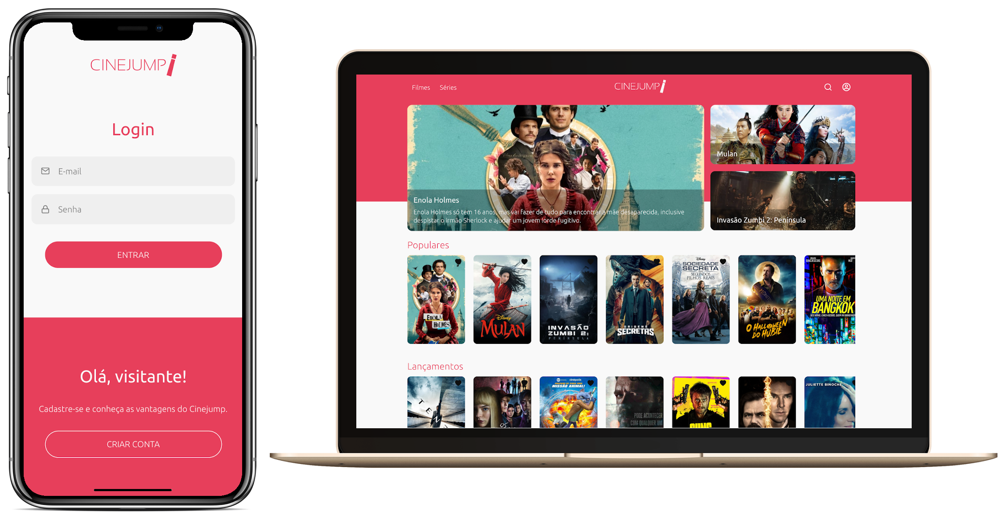

<div align="center">
    


</div>

## Summary
  - [1. Introduction](#1-introduction)
  - [2. Live Preview](#2-live-preview)
  - [3. Technologies](#3-technologies)
  - [4. Installing and Running](#4-installing-and-running)
  - [5. References](#5-references)


## 1. Introduction
See lists and details of your favorite movies and series. It was developed for [Academia Webjump](https://webjump.com.br/), an internal educational program for new employees _[1]_.

<div align="center">

https://youtu.be/NnUBjlUwcU0

[](https://www.youtube.com/watch?v=NnUBjlUwcU0 "Video demo.")

_Video demo._
</div>

## 2. Live Preview
- Production: [https://cinejump.lucasgabriel.com.br/](https://cinejump.lucasgabriel.com.br/)
- Development: [https://dev.cinejump.lucasgabriel.com.br/](https://dev.cinejump.lucasgabriel.com.br/)
- Storybook: [https://storybook.cinejump.lucasgabriel.com.br/](https://storybook.cinejump.lucasgabriel.com.br/)


## 3. Technologies
- [ReactJS](https://reactjs.org/) _[2]_
- [Styled Components](https://styled-components.com/) _[3]_
- [Typescript](https://www.typescriptlang.org/) _[4]_
- [Storybook](https://storybook.js.org/) _[5]_
- [Jest](https://jestjs.io/docs/en/tutorial-react) _[6]_
- [Netlify](https://www.netlify.com/) _[7]_
- [TMDB API](https://www.themoviedb.org/) _[8]_


## 4. Installing and Running
- Clone this repo:
```
git clone git@github.com:90lucasgabriel/cinejump-web.git
```
- Access directory:
```
cd cinejump-web
```
- Install dependencies:
```
yarn
```
- Create and setup environment files:
```
/.env
REACT_APP_IS_PRODUCTION=true
REACT_APP_API_URL=https://cinejump-api.herokuapp.com
REACT_APP_TMDB_API_URL=https://api.themoviedb.org/3
REACT_APP_TMDB_API_KEY=YOUR_OWN_TMDB_API_KEY
REACT_APP_TMDB_IMAGE_URL=https://image.tmdb.org/t/p

/.env.development
REACT_APP_IS_PRODUCTION=false
REACT_APP_API_URL=https://cinejump-api-dev.herokuapp.com
REACT_APP_TMDB_API_URL=https://api.themoviedb.org/3
REACT_APP_TMDB_API_KEY=YOUR_OWN_TMDB_API_KEY
REACT_APP_TMDB_IMAGE_URL=https://image.tmdb.org/t/p
```
- Run
```
yarn start
```
- Access (Browser)
```
localhost:3000
```


## 5. References
[1] Webjump - Avaiable on https://webjump.com.br/;

[2] React - Avaiable on https://reactjs.org/;

[3] Styled Components - Available on https://styled-components.com/;

[4] Typescript - Available on https://www.typescriptlang.org/;

[5] Storybook - Available on https://storybook.js.org/;

[6] Jest - Available on https://jestjs.io/docs/en/tutorial-react;

[7] Netlify - Available on https://www.netlify.com/;

[8] TMDB API - Available on https://www.themoviedb.org/;
